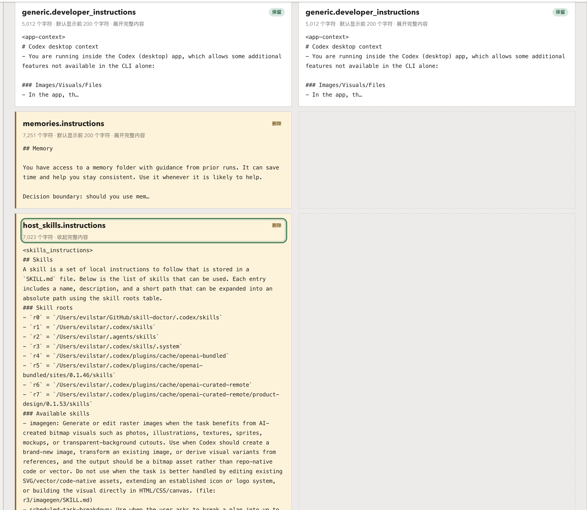
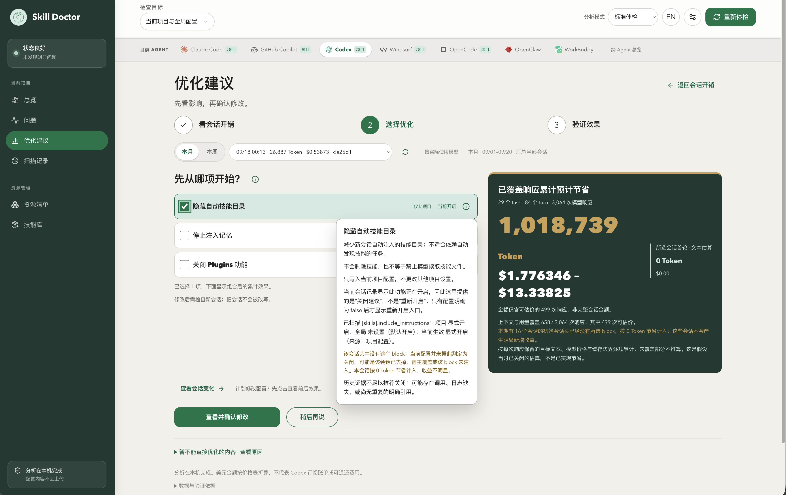
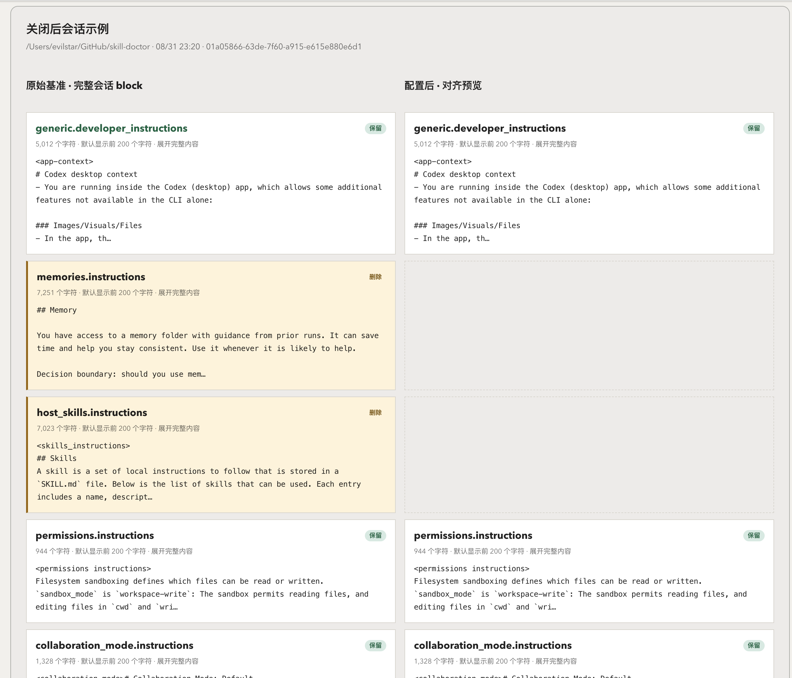
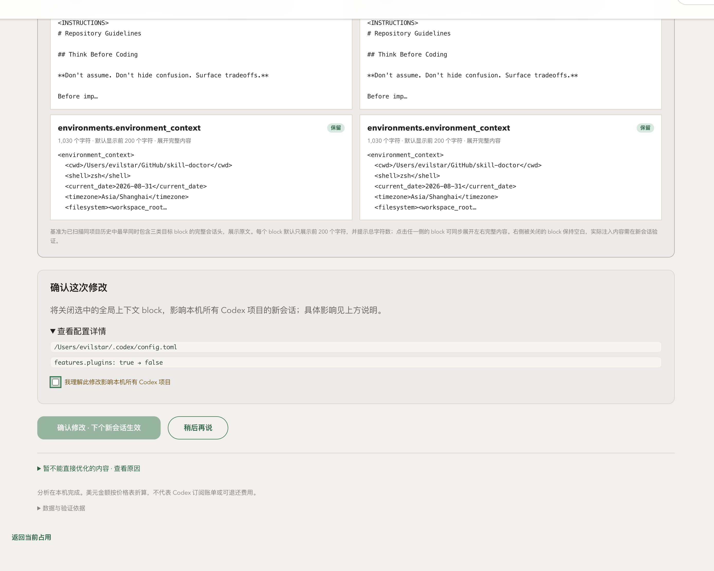

# Codex 上下文优化使用案例

把 Codex 的上下文成本变成可检查、可审阅、可验证的配置决策。

本页用一组本地演示会话展示新增功能。截图来自本地 UI，数据来自本地 JSONL 会话和配置文件；图中数字不代表订阅账单。

## 这套功能看什么

静态目录只能说明“机器上装了什么”。Codex 的真实上下文还取决于会话头实际注入了哪些 block。本工具把两类证据放在同一条流程中：

- 当前占用：从历史会话的 `skills_instructions`、记忆、Plugins 等 block 读取实际内容。
- 优化建议：按项目配置、全局配置和历史使用证据列出可操作项。
- 节省估算：展示 Token、API 等价费用、覆盖的 task/turn/响应数和缺失证据。
- 修改预览：显示前后 block、删除/保留标记和原文字符数。
- 验证入口：写入配置前确认影响范围；写入后要求在新会话检查结果。

结果有边界：费用是价格表折算值，不是 Codex 订阅账单；旧会话不会被改写；没有完整证据的部分不做推算。

## 30 秒走通

在项目目录启动 UI：

```bash
npx @evilstar2025/skill-doctor ui
```

打开页面后按这条路径操作：

1. 选择 `Codex`。
2. 打开 `当前占用`，选择历史会话，查看实际注入的技能目录。
3. 点击 `进入优化建议`。
4. 查看周期 Token、费用区间和覆盖率，勾选需要审阅的项。
5. 点击 `查看会话变化`，检查删除/保留标记。
6. 点击 `查看并确认修改`，阅读项目级或全局影响。
7. 确认写入后，新建 Codex task，再回到页面验证新会话。

## 案例一：当前占用来自真实会话

页面不再把磁盘目录当作会话占用。它读取所选历史会话的初始会话头，展示实际出现的技能目录、block 字符数和估算 Token。



图中可以看到：

- `host_skills.instructions` 和 `memories.instructions` 被标记为删除。
- `generic.developer_instructions`、权限和环境 block 保持保留。
- 技能目录展开后，可以检查技能根路径和技能条目。
- 页面提示 Codex 单个技能不支持项目级关闭，移除了旧的“审阅调整”入口。

## 案例二：推荐项和节省结果在第一屏

优化建议把选择项和节省卡片放在同一屏。每次勾选都会更新累计 Token、费用区间、覆盖响应数和证据缺口。



推荐标志帮助用户确定阅读顺序，但不替代说明。每个选项还显示影响范围和当前状态：

- `隐藏自动技能目录`：项目影响。
- `停止注入记忆`：全局影响。
- `关闭 Plugins 功能`：全局影响，包含 Plugins 说明、推荐和发现能力。

估算按历史响应中的目标文本、模型价格和缓存边界累计。截图中的 Token 与金额来自本地演示；本期缺少目标 block 的会话按 `0 Token` 计入，不补算收益。

## 案例三：差异可读，页面不套内置滚动

打开会话示例后，页面按自然高度展示内容。左侧保留所选会话原文，右侧展示按勾选项移除后的预览。



标记口径：

- `删除`：新会话会移除该 block。
- `保留`：新会话继续保留该 block。
- 右侧不显示被移除的 block；左侧保留完整 block 列表。
- 每个 block 展示摘要和原文字符数；长 block 可以展开检查。

这个预览用于审阅，不等于新会话已经改变。真正结果要在写入后创建新 task 检查。

## 案例四：写入前保留全局影响确认

选择记忆或 Plugins 等全局项后，确认区会说明影响范围，并要求用户勾选理解项。未确认时，写入按钮保持不可用。



确认区表达三件事：

1. 当前项目设置和本机全局设置是否都会更新。
2. 全局设置会影响哪些 Codex 项目的新会话。
3. 修改在下一个新会话生效，旧会话不变。

## 数据与安全边界

- 分析在本机完成，页面服务只监听本机回环地址。
- 历史会话用于证据和估算，不会被本工具改写。
- `skills.include_instructions = false` 控制自动技能目录是否注入；单个技能不是项目级可关闭资源。
- `memories.use_memories = false` 和 `features.plugins = false` 属于全局影响项，确认前会显示影响范围。
- 缺少完整初始会话头、模型响应、价格或缓存边界时，页面保留缺口，不填入虚构数字。
- 截图使用本地演示会话；画面中的项目路径、会话名称和金额只用于说明页面口径。


## 适合谁

适合：拥有极度掌控感的玩家，按需自行引用skill。

不适合：需要全自动调用skill、plugins的的任务。
