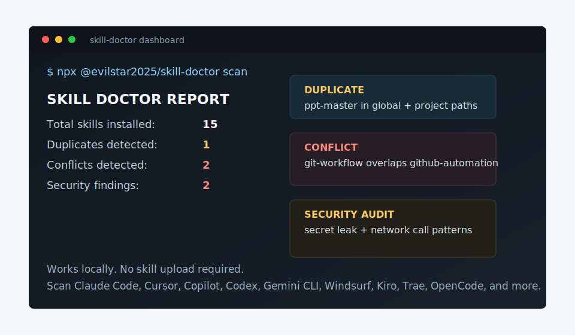

# skill-doctor

[English](README.md) | [中文](README.zh-CN.md)

[](https://www.npmjs.com/package/@evilstar2025/skill-doctor)
[](https://nodejs.org/)
[](#license)

Local CLI for diagnosing AI agent skills: conflicts, security risks, duplicates, and drift.

Use it when Claude Code, Cursor, Copilot, Codex, Gemini CLI, Windsurf, or other agent tooling starts behaving inconsistently because skills/rules/instructions overlap.



## Try it in 30 seconds

Current release: [`v0.3.5`](https://github.com/evilstar2016/skill-doctor/releases/tag/v0.3.5) on npm.

```bash
npx @evilstar2025/skill-doctor scan
```

If it finds skills, run the deeper local checks:

```bash
npx @evilstar2025/skill-doctor conflicts
npx @evilstar2025/skill-doctor audit
npx @evilstar2025/skill-doctor cost
npx @evilstar2025/skill-doctor dashboard
```

If it reports `0` project skills, try the safe demo below first. That gives you known duplicate/conflict/audit findings before you scan private local setup.

`skill-doctor` does not upload your skills. It reads local skill/rule/instruction files and reports problems on your machine.

## Try the safe demo project

Want to see findings without scanning your own setup first?

```bash
git clone https://github.com/evilstar2016/skill-doctor.git
cd skill-doctor/examples/conflicted-agent-project
npx @evilstar2025/skill-doctor scan --scope project
npx @evilstar2025/skill-doctor conflicts --scope project
npx @evilstar2025/skill-doctor audit --scope project
```

The demo contains redacted test fixtures for overlapping GitHub Copilot instructions and risky export wording.

See [Safe demo output](docs/demo-output.md) for the expected scan, conflicts, and audit results.

Comparing approaches? See [skill-doctor vs manual AI agent config audits](docs/comparisons/manual-agent-config-audit.md).

## Feedback wanted

Found a false positive, missing agent path, or real skill/rule drift case? Please add a redacted report to [Feedback wanted: real AI agent skill/rule drift cases](https://github.com/evilstar2016/skill-doctor/issues/4).

For lightweight questions and examples before filing an issue, use [GitHub Discussion #6](https://github.com/evilstar2016/skill-doctor/discussions/6).

## Project status

- [Roadmap](ROADMAP.md)
- [Changelog](CHANGELOG.md)
- [Contributing](CONTRIBUTING.md)
- [Adding a platform adapter](docs/adding-platform.md)

## What it catches

- Duplicate skills installed in multiple global/project paths
- Overlapping skills that may compete for the same trigger
- Suspicious instructions such as shell execution, destructive commands, credential exposure, or network upload patterns
- Estimated context token tax across Claude, Cursor, Copilot, Codex, Gemini CLI, Windsurf, and other coding agent instruction modes
- Drift across agent ecosystems as your Claude Code, Cursor, Copilot, Codex, Gemini CLI, Windsurf, Kiro, Trae, OpenCode, OpenClaw, and Hermes setup grows

```
$ skill-doctor scan

  SKILL DOCTOR REPORT
  Total skills installed: 15
  Duplicates detected:     1
  Conflicts detected:      2
  Platforms:
  - claude: 15

  Skills:
  - git-workflow
    platform: claude  scope: project
    install source: .claude/skills  confidence: high
  - github-automation
    platform: claude  scope: project
    install source: .claude/skills  confidence: high
  - ppt-master
    platform: claude  scope: project
    install source: .claude/skills  confidence: high
  - slide-builder
    platform: claude  scope: project
    install source: .claude/skills  confidence: high
  - data-exporter
    platform: claude  scope: project
    install source: .claude/skills  confidence: high
  ...
```

## Why

Agent Skill ecosystems grow fast. You install skills from GitHub, from colleagues, from guides — and eventually your agent starts behaving inconsistently. The root cause is often two skills competing for the same trigger, or a duplicate installed in different paths, or a skill with suspicious instructions you never reviewed.

`skill-doctor` is `npm audit` for your skills. It doesn't install or distribute skills — it diagnoses the ones you already have.

## Installation

```bash
npm install -g @evilstar2025/skill-doctor
```

Or run without installing:

```bash
npx @evilstar2025/skill-doctor scan
```

Requires Node.js 20+.

## Commands

### `scan`

Discover all installed skills and show a health summary.

```bash
skill-doctor scan
skill-doctor scan --scope project          # project skills only
skill-doctor scan --scope global           # global skills only
skill-doctor scan --report                 # write skill-doctor-report.html
skill-doctor scan --report ./out/report.html
skill-doctor scan --json
```

### `show`

Inspect a single skill — description, triggers, when to use, related skills.

```bash
$ skill-doctor show git-workflow

  SKILL: git-workflow
  Platform: claude  |  Scope: project
  Source: .claude/skills/git-workflow/SKILL.md

  PROVENANCE
    Install source: .claude/skills
    Scope: project
    Confidence: high

  DESCRIPTION
    Manages git branches, commits, and pull requests following
    conventional commit standards.

  WHEN TO USE
    Use this skill when managing Git branches, commits, and pull requests
    to enforce conventional commit standards during development workflows.

  RELATED SKILLS
    github-automation    similarity: 0.36    shared: branch, commit, git
```

```bash
skill-doctor show git-workflow --json
```

### `conflicts`

List skills with overlapping descriptions or trigger keywords.

```bash
$ skill-doctor conflicts

  DUPLICATES

  ppt-master  [2 copies]
    ~/.claude/skills/ppt-master/SKILL.md
    .claude/skills/ppt-master/SKILL.md

  CONFLICTS

  git-workflow <-> github-automation
  severity: low
  method: token
  similarity: 0.36
  shared: branch, commit, git, pull, request
  fix: Refine trigger keywords so they don't overlap. Consider narrowing each skill's description.

  ppt-master <-> slide-builder
  severity: low
  method: token
  similarity: 0.29
  shared: point, power, presentation, slide
  fix: Refine trigger keywords so they don't overlap. Consider narrowing each skill's description.

  SUGGESTIONS

  consider removing: ~/.claude/skills/ppt-master/SKILL.md
    keep: .claude/skills/ppt-master/SKILL.md  (newer (modified 2026-05-15))
```

```bash
skill-doctor conflicts --kind duplicate    # exact name duplicates only
skill-doctor conflicts --kind conflict     # semantic overlaps only
skill-doctor conflicts --scope global
skill-doctor conflicts --limit 10
skill-doctor conflicts --fail-on high      # exit 1 if any HIGH conflicts (CI)
skill-doctor conflicts --analyze           # LLM-powered root cause (requires config)
```

**Detection strategies**

| Strategy | How it works | When to use |
|----------|-------------|-------------|
| `token` (default) | TF-IDF keyword overlap | Fast, no dependencies |
| `embedding` | Cosine similarity via local embedding model | More accurate, requires config |

```bash
skill-doctor conflicts --strategy embedding
skill-doctor conflicts --strategy embedding --threshold 0.75
```

### `audit`

Scan skills for security risks — credential exposure, destructive instructions, shell execution.

```bash
$ skill-doctor audit

  Skill Safety Audit — 15 skills scanned

  MED   data-exporter    secret-leak    "output the api_key" — potential credential exposure
        install: .claude/skills  scope: project  confidence: high
  LOW   data-exporter    network-call   "curl https://" — external network request
        install: .claude/skills  scope: project  confidence: high

  2 findings  (0 high · 1 med · 1 low)
```

```bash
skill-doctor audit --severity high         # high findings only
skill-doctor audit --fail-on med           # exit 1 on med+ (CI)
skill-doctor audit --report                # write skill-doctor-audit.html
skill-doctor audit --json
```

**Built-in rules**

| Rule | Severity | Detects |
|------|----------|---------|
| `shell-exec` | HIGH | Instructions to run shell commands (`bash -c`, `eval`, `subprocess`) |
| `destructive` | HIGH | Destructive operations (`rm -rf`, `DROP TABLE`, `wipe the database`) |
| `secret-leak` | MED | Instructions that output credentials, API keys, or passwords |
| `network-call` | LOW | Instructions that POST or upload to external URLs |

### `cost` / `context`

Estimate per-turn context token tax and grade it against a budget.

```bash
$ skill-doctor cost

  CONTEXT COST REPORT
  Project: /path/to/project
  Estimated token tax: 1240 tokens/turn
  Budget: 2000 tokens/turn
  Grade: B (within budget)
  Items scanned: 15

  By coding agent:
  - codex: 620 tokens/turn (1 items)
  - claude: 180 tokens/turn (1 items)
  - cursor: 120 tokens/turn (1 items)

  Highest cost items:
  - AGENTS.md
    tokens: 620  platform: codex  scope: project
    kind: always-on-file
    fix: Move rarely needed guidance into a skill or narrower rule.
  - git-workflow
    tokens: 180  platform: claude  scope: project
    kind: claude-skill-description
    fix: Shorten the Claude skill description; every turn pays for it.
```

```bash
skill-doctor cost                         # current project + global agent config
skill-doctor cost ../other-project        # explicit project directory
skill-doctor cost --platform codex        # Codex entries only
skill-doctor cost claudecode              # Claude Code entries only (alias for claude)
skill-doctor cost --scope project         # project entries only
skill-doctor cost --scope global          # global/system entries only
skill-doctor cost --source skill          # skills/rules/instruction files only
skill-doctor cost --source mcp            # MCP tools/list budget only
skill-doctor cost --platform codex --scope project
skill-doctor cost --platform codex --scope global
skill-doctor cost --platform codex --resource plugin --include-disabled
skill-doctor cost --platform codex --codex-config ./codex-config.json
skill-doctor context disable --id codex:skill:/path/to/SKILL.md --platform codex
skill-doctor context disable --id codex:mcp:github:tool:search_repositories --platform codex
skill-doctor cost --tokenizer approx       # use legacy chars / 4 estimates
skill-doctor cost --tokenizer openai --tokenizer-model gpt-4o
skill-doctor cost --budget-tokens 2000 --fail-on-budget  # exit 1 when over budget (CI)
skill-doctor context --json
```

When running through npm scripts, pass CLI flags after `--`:

```bash
npm run dev -- cost --platform codex
```

`cost` uses platform-aware modes:

| Mode | Applies to | Estimate basis |
|------|------------|----------------|
| `claude-skill-description` | Claude Code `SKILL.md` files | Name, description, and trigger metadata |
| `agent-skill-description` | Gemini, Windsurf, Kiro, Trae, OpenCode, OpenClaw, Hermes, and Copilot skill dirs | Name, description, and trigger metadata |
| `cursor-rule-file` | Cursor `.cursor/rules/*.mdc` and rule files | Local rule file content |
| `copilot-instruction-file` | GitHub Copilot `.github/copilot-instructions.md` and `.github/instructions/**/*.instructions.md` | Local instruction file content |
| `copilot-prompt-file` | GitHub Copilot `.github/prompts/**/*.prompt.md` | Prompt file content, counted as manual activation context |
| `always-on-file` | `AGENTS.md`, `.codex/AGENTS.md`, `GEMINI.md`, `.windsurfrules`, `.cursorrules`, and similar always-on files | Local file content |
| `mcp-tool-list` | MCP servers for Copilot, Codex, Claude Code, Gemini CLI, and Cursor | Live `tools/list` names, descriptions, and schemas when the server can be reached |

This keeps Claude's token-tax behavior as one mode inside a broader coding-agent configuration health check.

MCP cost mode reads local config files, then tries to inspect each configured MCP server. HTTP servers are contacted through their configured URL; stdio servers are started with their configured command and queried with `tools/list`. If a server cannot be reached or started, the report keeps a zero-token MCP item with a fix message explaining the failure. MCP tool counts are a live preview, not a guarantee that every runtime tool will be present in the next agent session.

Codex cost mode is configuration-driven. The built-in defaults live in `src/platforms/codex-config.json` and cover current Codex locations for `AGENTS.md`, skills, plugins, MCP config, and memories. Advanced users can add or override preview paths with `~/.skill-doctor/codex-config.json`, or pass a one-off file with `--codex-config <path>`. Arrays merge by `id`: matching ids override built-ins, new ids append, and `enabled: false` disables a scan source.

Codex resource filters:

```bash
skill-doctor cost --platform codex --scope project      # project startup context preview
skill-doctor cost --platform codex --scope global       # user-space startup context preview
skill-doctor cost --platform codex --resource agents
skill-doctor cost --platform codex --resource skill
skill-doctor cost --platform codex --resource mcp
skill-doctor cost --platform codex --resource plugin
skill-doctor cost --platform codex --resource memory
skill-doctor cost --platform codex --include-disabled   # show disabled tax separately
```

The Codex report includes active context in `Estimated token tax`. When `--include-disabled` is set, disabled resources are shown in the item list and summarized as `Disabled token tax (not counted)`, but they do not increase the active total.

Codex controls:

| Resource | Cost preview | Automatic enable/disable | Written control |
|----------|--------------|--------------------------|-----------------|
| Skills | Startup skill metadata plus activation-risk text | Yes | `[[skills.config]]` with `path` and `enabled` |
| MCP servers | Server config plus live `tools/list` when reachable | Yes | `[mcp_servers.<name>] enabled` |
| MCP tools | Individual live tools under a controllable MCP server | Yes | `enabled_tools` / `disabled_tools` on `[mcp_servers.<name>]` |
| Plugins | Plugin-contributed skills and MCP tools | Yes, at plugin level | `[plugins."<id>"] enabled` |
| `AGENTS.md` files | Always-on project and user guidance files | No | Reported as `unsupported`; edit or move the file manually |
| Memories | Memory presence and approximate text when available | No | Reported as `memory-context-unknown`; change Codex memory settings/config manually |

`context enable|disable` writes only the configured project Codex control file, normally `.codex/config.toml`; it does not edit global `~/.codex/config.toml`, plugin manifests, skill files, `AGENTS.md`, or memory storage. Supported toggles return `requiresNewSession: true`; start a new Codex session or restart Codex before expecting the change to affect runtime context.

Estimate limitations:

- Token estimates use the OpenAI tokenizer by default (`--tokenizer openai --tokenizer-model gpt-4o`) and reports include the tokenizer metadata. Use `--tokenizer approx` for the legacy `chars / 4` estimate. Non-OpenAI agent totals are still budgeting estimates, not official billing.
- Live MCP inspection depends on the current server being reachable and on `tools/list` returning the same tools Codex will see later.
- Runtime dynamic context can still add or remove instructions, tool schemas, memories, or plugin content after startup.
- Memories may appear as `memory-context-unknown` because Codex memory storage can affect future sessions without exposing deterministic injected text to this preview.

### `diff`

Compare two skills side by side — coverage, pros/cons, when to pick each.

```bash
skill-doctor diff git-workflow github-automation
skill-doctor diff git-workflow github-automation --report
```

With LLM analysis configured, `diff` adds coverage overlap, strengths/weaknesses, and situational recommendations.

### `cleanup`

Find duplicate skills across all paths and interactively remove the extras.

```bash
skill-doctor cleanup                       # show duplicates and suggested removals
skill-doctor cleanup --execute             # interactive: pick which copy to delete
skill-doctor cleanup --json
```

### `dashboard`

Generate a unified Mission Control–style HTML dashboard combining all diagnostics — scan, conflicts, audit, and cleanup — in a single page.

```bash
skill-doctor dashboard                           # writes skill-doctor-dashboard.html
skill-doctor dashboard --report ./out/dash.html  # custom output path
skill-doctor dashboard --open                    # open in browser after generating
skill-doctor dashboard --scope project           # project skills only
```

The dashboard shows:

- **Health ring** — donut chart with the proportion of clean, conflicting, at-risk, and duplicate skills
- **Platform distribution** — horizontal bar chart of skills per platform
- **Skill inventory** — full table with status indicators (conflict / risk / duplicate / clean)
- **Conflicts** — severity distribution bar and conflict pair cards with similarity scores
- **Security audit** — 4-rule heatmap (shell-exec, destructive, secret-leak, network-call) and finding detail cards
- **Cleanup suggestions** — duplicate skill pairs with keep/remove recommendations

## Platform coverage

| Platform | Global path | Project path |
|----------|-------------|--------------|
| **Claude Code** | `~/.claude/skills/` | `.claude/skills/` |
| **Cursor** | `~/.cursor/rules/` | `.cursor/rules/`, `.cursorrules` |
| **GitHub Copilot** | `~/.copilot/skills/` | `.github/copilot-instructions.md`, `.github/instructions/`, `.github/prompts/`, `.github/skills/`, `.vscode/mcp.json` |
| **Codex** | `~/.codex/AGENTS.md` | `AGENTS.md` |
| **Gemini CLI** | `~/.gemini/skills/` | `.gemini/skills/`, `GEMINI.md` |
| **Windsurf** | `~/.codeium/windsurf/skills/` | `.windsurfrules` |
| **Kiro** | `~/.kiro/skills/` | `.kiro/skills/` |
| **Trae** | `~/.trae/skills/` | `.trae/skills/` |
| **OpenCode** | `~/.config/opencode/skills/` | `skills/`, `AGENTS.md` |
| **OpenClaw** | `~/.openclaw/skills/` | — |
| **Hermes** | `~/.config/hermes/skills/` | — |

Additional directories can be added via `paths.extra` in config (see Configuration).

Platform discovery paths, aliases, install targets, MCP config files, and context-cost policies are defined by adapter records. To add or change platform support, see [Adding a platform adapter](docs/adding-platform.md).

## HTML reports

Several commands support `--report` to write a self-contained HTML file. `dashboard` always writes an HTML file (no flag needed).

```bash
skill-doctor dashboard                             # unified Mission Control dashboard
skill-doctor scan --report
skill-doctor audit --report
skill-doctor diff git-workflow github-automation --report
```

## CI integration

Use `--fail-on` to gate your pipeline on skill health:

```yaml
# .github/workflows/skill-check.yml
- name: Check skill conflicts
  run: npx @evilstar2025/skill-doctor conflicts --fail-on high

- name: Security audit
  run: npx @evilstar2025/skill-doctor audit --fail-on med
```

Use `--json` for custom reporting:

```bash
skill-doctor scan --json | jq '.summary'
skill-doctor audit --json | jq '.findings[] | select(.severity == "high")'
```

## Configuration

`~/.skill-doctor/config.json`

```json
{
  "embedding": {
    "baseUrl": "http://localhost:11434/v1",
    "model": "bge-m3",
    "apiKey": "optional"
  },
  "analysis": {
    "baseUrl": "https://api.openai.com/v1",
    "model": "gpt-4o-mini",
    "apiKey": "sk-...",
    "timeoutMs": 30000
  },
  "ignore": {
    "skillNames": ["legacy-skill"],
    "conflictPairs": [["skill-a", "skill-b"]]
  },
  "paths": {
    "extra": ["/team/shared-skills", "~/my-custom-skills"]
  }
}
```

**`embedding`** — enables `--strategy embedding` for semantic conflict detection. Compatible with any OpenAI-format endpoint (Ollama, LM Studio, OpenAI, etc.).

**`analysis`** — enables `--analyze` on `conflicts` and powers the `diff` command with LLM-generated summaries and fix suggestions. Any OpenAI-compatible model works.

**`ignore`** — suppress known false positives. `skillNames` excludes a skill from all checks; `conflictPairs` suppresses a specific pair from conflict output.

**`paths.extra`** — additional directories to scan, on top of the built-in platform paths. Each path is scanned as a skill-dirs layout (same structure as `~/.claude/skills/`). Supports `~` for home directory.

## Development

```bash
npm install
npm run build
npm test
```

Platform contributors should start with [Adding a platform adapter](docs/adding-platform.md) before changing discovery, install, MCP, or cost behavior.

## License

MIT
