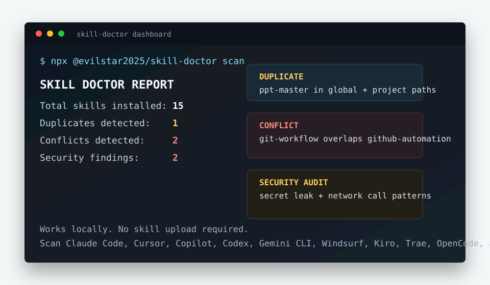

# skill-doctor

[English](README.md) | [中文](README.zh-CN.md)

### Codex 优化建议

运行 `skill-doctor ui`，选择 Codex 后点击 **优化建议**：看会话开销 → 选择优化 → 验证效果。
页面读取最近 7 天、最多 20 个任务的本地日志。大字展示会话累计预计节省的 Token 与 API 等价金额，旁边小字显示首轮估算、已记录 turn 数和响应数。累计按每条响应的目标文本与缓存边界计算；压缩、缺失上下文或价格会明确标注覆盖缺口，不简单按 turn 数相乘。

- 隐藏自动技能目录：项目配置 `skills.include_instructions = false`。
- 停止注入记忆：用户配置 `memories.use_memories = false`，需确认全局影响。

操作仅在调查验证过的 Desktop 版本 `0.154.0-alpha.6.2` 且初始会话头完整时开放。
配置写入后显示「待验证」，需手动新建 Desktop task，再读取其 JSONL 检查目标是否消失。
支持只恢复本次目标键的撤销；缺失用量或价格不虚构数字，美元金额不代表订阅账单或保证节省。
单个技能和推荐插件块的可靠关闭尚未确认，页面不提供相应禁用按钮。

### 旧版历史配置写入工具

**注意：** 以下旧命令只能证明配置被写入，不能证明 Desktop 会话头已移除目标。
调查中项目级单技能规则与推荐插件开关未生效。请优先使用上面的已验证流程，勿把写入成功当作收益。

旧流程提供历史证据、配置写入预览、确认与撤销，不卸载插件、不修改用户级配置。

```sh
# 在目标项目目录执行，报告不要上传或提交
skill-doctor benefit --json --output /tmp/project-benefit.json
skill-doctor context control --report /tmp/project-benefit.json --kind recommended_plugins --id 'figma@openai-curated-remote' --action disable
skill-doctor context control --report /tmp/project-benefit.json --kind recommendations --id recommended_plugins --action disable
# 确认预览后，重复对应命令并追加 --confirm <digest>
skill-doctor context control --undo <operation-id> --confirm <operation-id>
```

Skill 使用 `--kind skills_instructions --id '<目录中的Skill名称>'`。ID 来自报告
`historyAnalysis.usageProfile`。`--action enable` 显式开启，不等于精确撤销；逐项
开启不会重开已关闭的整块推荐。配置格式不支持、来源未验证或预览过期时拒绝修改。
备份在 `.codex/skill-doctor-operations/`，包含私人配置，请勿提交；撤销遇后续修改
会拒绝覆盖。需要受信任项目和新会话验证，写入成功不等于已经节省 Token。

页面提供 Agent 驱动提示词。已有 `skill-doctor-context-optimizer` 技能新增 `history`、
`history-control`、`history-undo` 入口，要求先输出完整证据报告，再等待用户确认。
CLI 帮助必须包含 `context control`；旧版本不能用禁用已安装插件的命令代替。

<p align="center">
  
</p>

[](https://www.npmjs.com/package/@evilstar2025/skill-doctor)
[](https://nodejs.org/)
[](#license)

`skill-doctor` 是一个本地 CLI，用来诊断 AI Agent 的 skills、rules、instructions：重复安装、触发冲突、安全风险、上下文成本和多工具漂移。

当 Claude Code、Cursor、Copilot、Codex、Gemini CLI、Windsurf、WorkBuddy、InfCode 等工具因为配置重叠而表现不一致时，可以先用它做一次本地体检。



> 👉 想看图看效果？打开 **[中文图文使用手册（HTML）](https://evilstar2016.github.io/skill-doctor/zh-CN/pages/manual.html)** —— 每个命令都有真实终端截图和界面走查。

## 30 秒试用

当前版本：npm 上的 [`v0.6.0`](https://github.com/evilstar2016/skill-doctor/releases/tag/v0.6.0)。

```bash
npx @evilstar2025/skill-doctor scan
```

也可以直接启动完整的本地产品界面：

```bash
npx @evilstar2025/skill-doctor ui
```

界面会在本机浏览器中打开，提供总览、统一待处理列表、上下文成本、资源清单、详情与对比、Codex 资源开关、重复清理、Skill 安装卸载和静态报告导出。服务只监听本机回环地址，并使用临时会话验证。

如果扫描到了本地 skills，可以继续跑更深入的检查：

```bash
npx @evilstar2025/skill-doctor conflicts
npx @evilstar2025/skill-doctor audit
npx @evilstar2025/skill-doctor cost
npx @evilstar2025/skill-doctor dashboard
```

如果你使用 WorkBuddy，可以直接指定平台：

```bash
npx @evilstar2025/skill-doctor@0.6.0 scan --platform workbuddy
npx @evilstar2025/skill-doctor@0.6.0 cost --platform workbuddy
```

如果你使用 InfCode，可以直接指定平台：

```bash
npx @evilstar2025/skill-doctor@0.6.0 scan --platform infcode
npx @evilstar2025/skill-doctor@0.6.0 cost --platform infcode
```

如果结果显示 `0` 个 project skills，建议先跑下面的安全 demo。demo 会展示已知的重复、冲突和审计结果，不需要先扫描你的私人配置。

`skill-doctor` 不会上传你的 skills。它只读取本地 skill/rule/instruction 文件，并在你的机器上输出诊断结果。

## 安全 demo 项目

```bash
git clone https://github.com/evilstar2016/skill-doctor.git
cd skill-doctor/examples/conflicted-agent-project
npx @evilstar2025/skill-doctor scan --scope project
npx @evilstar2025/skill-doctor conflicts --scope project
npx @evilstar2025/skill-doctor audit --scope project
npx @evilstar2025/skill-doctor cost --scope project
```

这个 demo 使用脱敏测试夹具，模拟 GitHub Copilot instructions 重叠和可疑导出措辞。

预期输出见：[Safe demo output](DEMO_OUTPUT.md)。

如果你正在比较手工审查、grep、内部 lint 和自动扫描的取舍，见：[skill-doctor vs manual AI agent config audits](COMPARISON.md)。

## 反馈入口

如果你遇到误报、缺失的 Agent 路径，或者真实的 skill/rule 漂移案例，请把脱敏信息提交到：[Feedback wanted: real AI agent skill/rule drift cases](https://github.com/evilstar2016/skill-doctor/issues/4)。

轻量问题和示例可以放到：[GitHub Discussion #6](https://github.com/evilstar2016/skill-doctor/discussions/6)。

## 项目状态

- [Roadmap](ROADMAP.md)
- [Changelog](CHANGELOG.md)
- [Contributing](CONTRIBUTING.md)

## 能发现什么

- 同一个 skill 被安装到多个 global/project 路径
- 多个 skills 触发词或描述重叠，导致 Agent 抢任务或行为不稳定
- 可疑指令，例如 shell 执行、破坏性命令、凭据暴露、网络上传
- Claude skill 描述和 always-on instruction 文件带来的每轮上下文 token 成本
- Claude Code、Cursor、Copilot、Codex、Gemini CLI、Windsurf、Kiro、Trae、OpenCode、OpenClaw、Hermes、WorkBuddy、InfCode 等生态之间的配置漂移

## 为什么需要它

AI Agent 的配置层正在快速膨胀：skills、rules、instructions、项目记忆、全局记忆、团队约定都会逐渐堆起来。

问题通常不是某个模型突然变差，而是两个配置在同一个任务上同时触发，或者某个旧文件里藏着没人再记得的高风险指令。

`skill-doctor` 的定位类似 `npm audit`，但审计对象是你本地已经安装或写下的 Agent skills 和 instructions。它不负责分发 skills，只负责帮你看清现有配置层的问题。

## 安装

```bash
npm install -g @evilstar2025/skill-doctor
```

也可以不安装，直接运行：

```bash
npx @evilstar2025/skill-doctor scan
```

要求 Node.js 20+。

## 常用命令

### `scan`

发现本地已安装的 skills，并输出健康概览。

```bash
skill-doctor scan
skill-doctor scan --scope project
skill-doctor scan --scope global
skill-doctor scan --report
skill-doctor scan --json
```

### `conflicts`

找出重复 skills 和触发词/描述重叠。

```bash
skill-doctor conflicts
skill-doctor conflicts --kind duplicate
skill-doctor conflicts --kind conflict
skill-doctor conflicts --fail-on high
skill-doctor conflicts --json
```

### `audit`

扫描可疑安全风险，例如凭据暴露、破坏性命令、shell 执行、网络上传。

```bash
skill-doctor audit
skill-doctor audit --severity high
skill-doctor audit --fail-on high
skill-doctor audit --report
skill-doctor audit --json
```

### `cost` / `context`

估算每轮对话都会付出的上下文 token 成本，并按预算给出等级。

```bash
skill-doctor cost
skill-doctor cost --platform codex
skill-doctor cost claudecode
skill-doctor cost --source skill
skill-doctor cost --source mcp
skill-doctor cost --platform codex --scope project
skill-doctor cost --platform codex --scope global
skill-doctor cost --platform codex --resource plugin --show-disable
skill-doctor cost --platform codex --resource plugin --include-cache
skill-doctor cost --platform codex --codex-config ./codex-config.json
skill-doctor context disable --id codex:skill:/path/to/SKILL.md --platform codex
skill-doctor context disable --id codex:mcp:github:tool:search_repositories --platform codex
skill-doctor cost --tokenizer approx       # 使用旧版 chars / 4 估算
skill-doctor cost --tokenizer openai --tokenizer-model gpt-4o
skill-doctor cost --budget-tokens 2000 --fail-on-budget
skill-doctor context --json
```

对 Claude Code skills，`cost` 估算始终注入的 name、description、trigger 元数据，而不是完整 skill 正文。对 `AGENTS.md` 这类 always-on 文件，它会估算本地文件内容。

`--source skill|mcp|all` 可以选择只统计 skills/rules/instruction/prompt files、只统计 MCP 工具列表，或两者都统计。Copilot 模式会覆盖 `.github/copilot-instructions.md`、`.github/instructions/**/*.instructions.md`、`.github/prompts/**/*.prompt.md`、Copilot skills、`AGENTS.md` 以及 `.vscode/mcp.json`/`.github/mcp.json` 中的 MCP。MCP 模式会先读取本地配置，再尝试访问每个 MCP server：HTTP 服务会通过配置 URL 调用，stdio 服务会按配置命令启动，并调用 `tools/list` 读取工具名称、说明和 schema 后估算 token。如果服务不可访问或无法启动，报告会保留一个 0 token 的 MCP 项，并在修复建议里提示失败原因。MCP 工具数量是一次 live preview，不保证下一次 Agent 会话看到的 runtime 工具完全一致。

Codex 模式使用独立配置驱动。内置默认值在 `src/platforms/codex-config.json`，覆盖当前 Codex 的 `AGENTS.md`、skills、plugins、MCP 配置和 memories 位置。高级用户可以用 `~/.skill-doctor/codex-config.json` 追加或覆盖路径，也可以临时传 `--codex-config <path>`。数组按 `id` 合并：同 id 覆盖内置项，新 id 追加，`enabled: false` 禁用该扫描源。

Codex 可用 `--resource all|agents|skill|mcp|plugin|memory` 过滤资源：

```bash
skill-doctor cost --platform codex --scope project      # 预览项目启动上下文
skill-doctor cost --platform codex --scope global       # 预览用户空间启动上下文
skill-doctor cost --platform codex --resource agents
skill-doctor cost --platform codex --resource skill
skill-doctor cost --platform codex --resource mcp
skill-doctor cost --platform codex --resource plugin
skill-doctor cost --platform codex --resource memory
skill-doctor cost --platform codex --show-disable       # 单独显示已禁用资源
skill-doctor cost --platform codex --resource plugin --include-cache  # 盘点缓存 UI 条目，不增加 token 成本
```

不传 `--scope` 时，`cost` 使用 `all` 范围：当前项目资源加上已启用的用户/全局资源。例如，`~/.codex/plugins/` 下 plugin 的已启用 skill 会以 `scope: global` 出现，因为它会影响所有 Codex 项目；`[[skills.config]]` 选择器仍可单独禁用 plugin skill。使用 `--scope project` 可只查看当前项目配置的文件。

Codex 报告中的 `Estimated token tax`、`items` 和 `resources` 只包含当前启用的上下文。加上 `--show-disable` 后，已禁用的 skill、MCP server、plugin 等资源会显示在独立的 `Disabled resources (not counted)` 区域；JSON 输出使用 `disabledItems` 和 `disabledResources`。可控制的条目会附带对应的 `context enable` 命令。旧参数 `--include-disabled` 仍作为兼容别名保留。

`--include-cache` 会单独盘点 `~/.codex/plugins/cache` 中插件和 Skill 的 UI 元数据，包括显示名称、描述、图标路径、缓存来源，以及允许隐式调用还是仅显式调用。缓存目录条目统一标记为 `cached` 和 `not counted`；仅仅能在 Codex 界面里看到某个入口，不会被当成它已经进入模型上下文的证据。该选项用于 Codex 的 `--resource all|plugin`，JSON 输出会把结构化盘点放在 `catalog` 字段中。

### `benefit`（Codex 历史收益预估）

[查看浏览器实操图解：方案输入、结果解读、模型筛选与导出](docs/zh-CN/pages/manual.html#benefit)。图解包含真实项目截图及本次无法估算收益的原因。

将 Skill Doctor 优化方案与当前项目最近的 Codex rollout JSONL 会话对齐，预估
输入 Token、总 Token 和等价 API 费用的变化。分析在本机完成，不重新执行 Codex，
也不修改 Codex 配置，更不能把结果当作订阅账单下降。

```bash
skill-doctor benefit --project . --since 24h --limit 20
skill-doctor benefit --project . --since 24h --limit 20 --plan <plan-id>
skill-doctor benefit --project . --since 7d --limit 50 --plan <plan-id> --format json --output benefit.json
skill-doctor benefit --project . --since 24h --plan <plan-id> --tokenizer openai --tokenizer-model gpt-4o --format html --output benefit.html
skill-doctor benefit --project . --include-archived --price-table ./prices.json
skill-doctor benefit --project . --retention-days 30
skill-doctor benefit --project . --delete-index --json
skill-doctor benefit --project . --delete-index-entry /path/to/rollout.jsonl --json
```

报告会分开展示历史输入、缓存读写、输出和推理用量。资源方案默认推荐“持续上下文扣减”，
另提供“历史缓存比例延续”和“缓存重建敏感性”费用情景、模型价格覆盖率、跳过会话原因，以及响应对应的
JSONL 文件和行号。没有匹配方案时仍会输出历史基线，但不会虚构预计节省。

历史上下文归因只保留可恢复的源文件/行号和正文 hash；增量索引不保存 AGENTS 或
Skill 正文，命中索引但需要文本重建时会从本机 rollout 重新读取。宿主 Skill 清单被
截断、重复或缺少完整性证据时，结果保持“证据不足”，不会把缺失条目当成已删除。

如果方案带有明确的资源选择，预计结果会从匹配到的历史上下文快照中重建优化前后
文本，并用 tokenizer 计算实际差值；未匹配响应保持不变。没有逐资源证据的方案才会
使用 Optimizer 静态估算的比例模拟。两条路径都默认保持输出、推理、工具调用、重试、
压缩、质量和耗时不变。金额只是等价 API 价格估算，不是 Codex 或 ChatGPT 订阅账单。

持续上下文不是只计首次发送：若移除的 Skill 目录描述差额为 `d`，并在 `N` 条响应的
有效上下文中都存在，累计输入节省为 `d × N`（每条仍受实测输入上限约束）。WebSocket
后续不再传递同一段文本，不代表该段不参与模型输入计费。压缩失效或没有可恢复上下文
的响应不外推。tokenizer 保留原文空白；默认编码仍是近似值，不等于服务端精确分词。

推荐情景假设被精简片段属于缓存前缀：每条响应优先扣实测缓存读取量，其次缓存写入，
余量扣普通输入；首轮无缓存时全部扣普通输入。总输入已包含缓存，不再重复加减。
费用按 `普通输入 × 单价 + 缓存读取 × 单价 + 缓存写入 × 单价 + 输出 × 单价` 计算。
这是归属假设，不是逐 Skill 缓存命中证据，也不假设首次请求必然产生额外缓存写入费。
例如每轮少 100 Token、共 10 轮，输入减少 1,000 Token；若首轮未缓存、后九轮命中，
费用节省为 `100 × 普通输入单价 + 900 × 缓存读取单价`，而非 1,000 Token 全按普通价。
禁用 Skill 不自动删除历史上已经加载的正文或工具结果；当前仅模拟可识别的目录描述。
功能边界和验收进度见内部清单：
`doc/codex-optimization-benefit-checklist.zh-CN.md`。

`--tokenizer approx` 只适合快速进行 chars/4 近似比较；报告会记录 tokenizer、模型和
fallback。`--format html` 输出静态、已转义且脱敏的预览；`--format json --redact` 输出
适合分享的脱敏 JSON，默认 JSON 则保留本地追溯字段，便于本地复算。
本地增量索引只保存必要元数据；需要删除这份可重建索引时，显式使用 `--delete-index`。
也可以用 `--retention-days N` 清理超过 N 天的索引元数据，或用 `--delete-index-entry` 删除单个源文件对应的索引记录；这些操作只删除 Skill Doctor 自有索引，不删除 Codex 会话文件。

自定义价格表中的每个模型必须声明 `maxInputTokens` 或 `inputTiers`；没有明确长上下文
适用范围的金额会显示为不可估，但 Token 指标仍会保留。UI 收益分析使用可取消的本地
job，并通过 SSE 展示读取、解析/关联、方案校验和模拟阶段。

Codex 控制能力：

| 资源 | 成本预览 | 自动启用/禁用 | 写入位置 |
|------|----------|---------------|----------|
| Skills | 启动时的 skill 元数据和 activation-risk 文本 | 仅配置；需新任务验证 | `[[skills.config]]` 的 `path` 和 `enabled` |
| MCP servers | server 配置，以及可访问时的 live `tools/list` | 仅配置；需新任务验证 | `[mcp_servers.<name>] enabled` |
| MCP tools | 可控 MCP server 下的单个 live tool | 仅配置；需新任务验证 | `[mcp_servers.<name>]` 的 `enabled_tools` / `disabled_tools` |
| Plugins | plugin 提供的 skills 和 MCP tools | 仅配置；需新任务验证 | `[plugins."<id>"] enabled` |
| `AGENTS.md` 文件 | 项目和用户空间 always-on 指导文件 | 不支持 | 标记为 `unsupported`；需要手动编辑或移动文件 |
| Memories | memory 存在状态，以及可近似读取时的文本 | 不支持 | 标记为 `memory-context-unknown`；需要手动改 Codex memory 设置/配置 |

`context enable|disable` 只写入配置中的项目级 Codex 控制文件，通常是 `.codex/config.toml`；它不会编辑全局 `~/.codex/config.toml`、plugin manifest、skill 文件、`AGENTS.md` 或 memory 存储。结果会区分 `changed`/`controlStatus: configured` 与运行时验证，并返回 `requiresNewSession: true`。请新建 Codex task 或重启 Codex 后，用 `skill-doctor context blocks --file <新会话.jsonl> --json` 检查 `verification` 和 provenance，再判断会话头是否真的移除。

估算限制：

- token 估算默认使用 OpenAI tokenizer（`--tokenizer openai --tokenizer-model gpt-4o`），报告会显示 tokenizer 元数据。需要旧版 `chars / 4` 估算时使用 `--tokenizer approx`。非 OpenAI agent 的数字仍是预算估算，不代表对应平台的官方计费。
- live MCP 检查依赖当前 server 可访问，并且 `tools/list` 返回的工具与之后 Codex runtime 看到的一致。
- runtime dynamic context 仍可能在启动后增加或减少 instructions、tool schemas、memories 或 plugin 内容。
- Memories 可能显示为 `memory-context-unknown`，因为 Codex memory storage 会影响未来会话，但不一定暴露可确定的注入文本给 preview。

WorkBuddy 支持扫描用户级 `~/.workbuddy/skills/`、连接器 `~/.workbuddy/connectors/skills/`、项目级 `.workbuddy/skills/`，以及 `IDENTITY.md`、`USER.md`、`SOUL.md`、`MEMORY.md` 四个长期上下文文件。静态 MCP 配置来自 `~/.workbuddy/mcp.json` 和 `.workbuddy/mcp.json`；安装目标为 `workbuddy-global-skills` 与 `workbuddy-project-skills`。市场缓存、动态连接器 MCP 和插件/内置运行时状态不会被当作已启用资源。

InfCode 支持扫描全局 `~/.infcode/skills/`、`~/.infcode/rules/`，项目级 `.infcode/skills/`、`.infcode/rules/`，以及项目 MCP 配置 `.infcode/mcpServers/mcp.json`。

### `dashboard`

生成 HTML 仪表盘，方便审查扫描结果。

```bash
skill-doctor dashboard
skill-doctor dashboard --report ./skill-doctor-report.html
```

### `ui`

启动完整的本地管理界面。默认使用当前目录，也可以指定项目目录。

```bash
skill-doctor ui
skill-doctor ui ./my-project
skill-doctor ui --no-open
skill-doctor ui --port 43123
```

## 安全边界

- 默认只读取本地文件
- 不默认上传你的 skills、rules 或 instructions
- 适合先在 demo 项目里试，再决定是否扫描真实项目
- 如果要分享反馈，请先脱敏路径、密钥、客户名、内部 URL 和私有代码

## License

MIT — 见 [LICENSE](LICENSE)。
