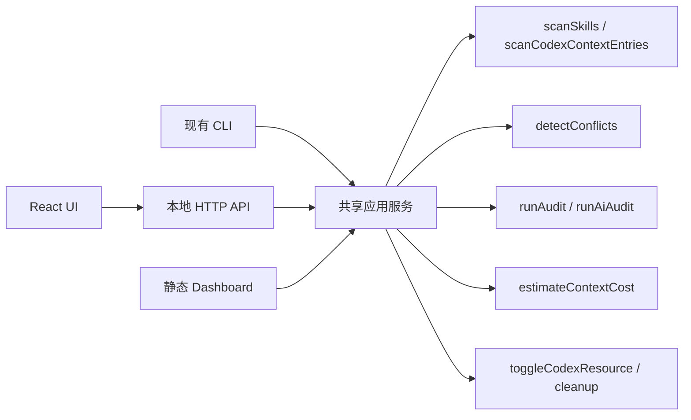

# Skill Doctor 前端功能与技术规划

## 1. 产品目标

Skill Doctor 的前端不是把 CLI 输出简单搬到网页，而是把现有检测能力组织成一条清晰的使用路径：

1. 选择检查范围。
2. 一键完成本地体检。
3. 先看到最值得处理的问题。
4. 理解证据、影响与建议。
5. 在明确确认后执行受支持的治理操作。

产品定位保持为：

> 本地的 AI Agent 配置体检与治理台。

前端服务于日常使用和问题处理；CLI 继续服务于自动化、CI 和高级参数场景；现有静态 dashboard 继续服务于分享和归档。

### 1.1 完整版本成功标准

- 新用户不阅读命令文档，也能完成第一次项目体检。
- 首屏直接回答“有没有问题”和“先处理什么”。
- 安全、冲突、重复和上下文成本使用统一的信息结构。
- 每个问题都能追溯到资源、文件路径和命中证据。
- 扫描默认只在本机完成，不要求登录或上传配置内容。
- UI 与 CLI 复用同一应用服务，不维护两套检测逻辑。

### 1.2 产品边界

- 账号、云同步和团队工作区。
- 在线 marketplace。
- 自动修改 skill 正文。
- 未经确认删除文件或关闭资源。
- 扫描历史数据库和复杂趋势分析。
- 为了 UI 重写现有扫描、冲突、审计或成本计算模块。

## 2. 视觉与体验方向

参考界面的整体方向可保留：固定导航、单一强调色、大量留白、低噪声表格和清晰的主操作。它已经具备现代 AI 工具常见的克制感。

建议进一步调整：

- 从偏黄的整页底色调整为更中性的暖灰背景，内容区域使用白色或接近白色的表面，提升长时间阅读舒适度。
- 保留低饱和绿色作为品牌强调色，但只用于当前导航、主按钮和成功状态。
- “需检查”“有冲突”不能都使用绿色。风险状态应使用语义色，并同时提供文字或图标，不能只依赖颜色。
- 提升正文、次级文字和边框的对比度；当前参考图中浅灰说明文字偏淡。
- 资源名称继续使用等宽字体；界面正文使用系统无衬线字体，中文优先匹配苹方、微软雅黑。
- 首屏避免使用抽象健康百分比，优先展示“高风险 1 项”“待处理 3 项”等可验证事实。

### 2.1 设计原则

1. **任务优先**：先显示需要处理的内容，再显示统计。
2. **渐进披露**：列表保持简洁，证据、路径和高级信息进入详情抽屉。
3. **一个主操作**：每个页面只保留一个高强调按钮。
4. **结果可解释**：问题必须同时展示来源、证据、影响和建议。
5. **危险操作可逆或可预览**：修改前展示影响，删除前必须二次确认。
6. **部分失败仍有结果**：某个 MCP 无法访问时，保留其他扫描结果并单独提示。

### 2.2 设计令牌建议

颜色应以 CSS 变量实现，所有组件只引用语义令牌：

```css
:root {
  --background: #f7f7f5;
  --surface: #ffffff;
  --surface-subtle: #f1f3ef;
  --foreground: #202722;
  --foreground-muted: #667067;
  --border: #e1e5df;
  --accent: #5f8958;
  --accent-hover: #52784c;
  --accent-soft: #e7efe4;
  --warning: #9a6700;
  --warning-soft: #fff4d6;
  --danger: #b42318;
  --danger-soft: #fee9e7;
  --info: #356a8a;
  --info-soft: #e6f1f7;
}
```

这些值是实现起点，不是最终验收值。最终颜色需通过 WCAG AA 对比度检查，并提供同名 dark theme 令牌。

### 2.3 字体与密度

- 正文：`Inter, -apple-system, BlinkMacSystemFont, "Segoe UI", "PingFang SC", "Microsoft YaHei", sans-serif`。
- 资源名与短路径：`"SFMono-Regular", Consolas, "Liberation Mono", monospace`。
- 正文字号 14–16px；辅助文字不低于 12px。
- 内容最大宽度约 1200px，避免超宽屏表格横向拉散。
- 使用 4px 基础间距体系，主要间距采用 8、12、16、24、32px。
- 动画只用于扫描状态、抽屉和列表更新，并尊重 `prefers-reduced-motion`。

## 3. 信息架构

产品保留五个一级入口：

| 页面 | 回答的问题 | 主要内容 |
| --- | --- | --- |
| 总览 | 我现在最该做什么？ | 检查状态、优先问题、关键事实、最近一次扫描范围 |
| 待处理 | 具体有哪些问题？ | 安全、冲突、重复、成本问题的统一列表和详情 |
| 上下文成本 | 哪些配置持续占用上下文？ | 固定成本、按需成本、资源排行、可控制状态 |
| 资源清单 | 我的 Agent 实际加载了什么？ | skills、rules、instructions、MCP、plugins、memories |
| 管理与导出 | 如何安装、卸载和分享结果？ | 本地或 marketplace 安装、登记项卸载、静态报告导出 |

设置不作为一级导航，通过右上角抽屉管理分析深度、平台、预算和 tokenizer，避免侧栏膨胀。

### 3.1 全局区域

所有页面共享：

- 当前检查目标：当前项目、当前项目与全局、仅全局。
- `重新体检` 主按钮。
- 最近检查时间、资源数量和扫描结果状态。
- 扫描中的阶段提示。
- 部分失败或权限不足提示。

检查目标默认来自启动命令的工作目录。界面不提供任意路径文本输入，避免路径输入错误和额外安全面；可通过 `skill-doctor ui [project-dir]` 指定项目。

## 4. 页面功能规划

### 4.1 首次进入与空状态

首次进入不展示空表格，而是显示：

- 当前识别出的项目路径。
- 将检查的配置类型和范围。
- “分析在本机完成，不上传 skill 内容”的隐私说明。
- `开始体检` 主按钮。

当没有发现资源时，区分三种情况：

1. 项目确实没有 Agent 配置。
2. 当前范围选择不合适。
3. 平台路径未被支持或无权读取。

分别给出“检查全局配置”“查看支持的平台”“复制诊断信息”等动作。

### 4.2 总览

首屏内容按以下顺序排列：

1. **优先处理**：最多展示三项，按严重度、影响范围和可操作性排序。
2. **关键事实**：资源总数、高风险数、冲突数、固定上下文成本。
3. **平台与范围摘要**：只显示实际发现的平台。
4. **部分扫描警告**：例如 MCP 不可访问、成本未知或配置解析失败。

不展示人为计算的健康百分比。干净状态直接使用“未发现高风险或冲突”，同时声明扫描边界。

### 4.3 待处理

把不同后端结果适配为统一的 `Issue`：

- `security`：来自 `AuditFinding` / `AiFinding`。
- `conflict`：来自非重复的 `ConflictPair`。
- `duplicate`：来自重复项和 `CleanupSuggestion`。
- `context`：来自超预算、固定成本过高或估算状态异常的 `ContextCostItem`。

列表功能：

- 默认按严重度、问题类型和资源名排序。
- 按问题类型、严重度、平台和范围筛选。
- 搜索资源名、路径和问题标题。
- 展示受影响资源、简短影响和首选动作。

详情抽屉包含：

- 问题标题、类型、严重度和检测方式。
- 受影响的资源及作用域。
- 命中证据或共享触发词。
- 为什么可能造成问题。
- 建议处理方式和限制。
- 复制路径、复制建议、并排对比等只读动作。

删除重复项已纳入产品。执行前展示两个路径并要求用户选择和输入完整路径确认，不能直接采用“较新文件一定正确”的假设。

### 4.4 上下文成本

顶部只显示真正影响决策的指标：

- 每轮固定成本：`startup-selection + always-on`。
- 按需激活成本：`activation`，不能与固定成本相加后称为“每轮成本”。
- 预算状态与 tokenizer 信息。

主体以按成本排序的列表为主，展示：

- 资源名称、类型、平台和范围。
- 激活方式：启动、always-on、按需、文件范围、手动。
- 估算 token、估算可信度和推荐意见。
- 已禁用资源单独分组，不计入当前总成本。
- 缓存 UI 条目标记为“可见但未计入上下文”。

对可控制的 Codex 资源提供启用/禁用操作，复用现有 `toggleCodexResource`。确认框必须说明写入的配置路径和“新会话后生效”。不支持自动控制的资源只展示手动建议。

### 4.5 资源清单

表格列建议为：

- 名称。
- 资源类型。
- 平台。
- 范围。
- 激活方式或启用状态。
- 问题状态。

默认只展示必要列，来源、作者、仓库、完整路径、触发词和成本放入详情抽屉。

交互：

- 搜索名称、路径、描述和触发词。
- 按类型、平台、范围、启用状态筛选。
- 点击行打开详情，不在表格中堆叠操作按钮。
- 资源与问题互相跳转。
- 典型数量在本地直接筛选，不引入分页和数据库。

### 4.6 扫描体验

扫描状态至少包含：

```text
idle → discovering → conflicts → audit → context → complete
                                                ↘ partial
                                                ↘ failed
```

- 快速扫描直接在同一页面更新。
- MCP live discovery、embedding 或 AI audit 可能较慢，需显示当前阶段和取消入口。
- 扫描过程中保留上一次结果，使用非阻塞进度层，不让页面清空闪烁。
- 取消扫描只中止本次任务，不影响已有结果。
- 完成后更新当前内存快照；长期扫描历史仍属于后续独立能力。

## 5. 前端组件规划

建议组件边界：

```text
AppShell
├── SidebarNavigation
├── TargetToolbar
│   ├── TargetSelector
│   ├── ScanStatus
│   └── ScanButton
└── RouteOutlet
    ├── OverviewPage
    │   ├── PriorityIssueList
    │   ├── FactStrip
    │   └── ScanWarnings
    ├── IssuesPage
    │   ├── IssueFilterBar
    │   ├── IssueList
    │   └── IssueDetailDrawer
    ├── ContextPage
    │   ├── ContextSummary
    │   ├── ContextCostList
    │   └── ResourceToggleDialog
    └── ResourcesPage
        ├── ResourceFilterBar
        ├── ResourceTable
        └── ResourceDetailDrawer
```

共享基础组件控制在较小范围：`Button`、`IconButton`、`Select`、`SearchInput`、`Badge`、`Drawer`、`Dialog`、`EmptyState`、`InlineNotice`、`Skeleton`、`Toast`。

不引入完整企业级组件库。它会带入大量未使用样式，也容易让产品失去自己的视觉特征。

## 6. 技术架构

### 6.1 推荐技术栈

- React + TypeScript：贡献者熟悉度高，适合列表、详情抽屉和异步状态。
- Vite：只负责编译前端资源，产物写入 `dist/ui`。
- 原生 CSS + CSS variables：实现设计令牌和主题，不引入 Tailwind 运行时或整套 UI 框架。
- Lucide React：统一线性图标，通过 tree-shaking 控制体积。
- Node `http`：实现本地服务，不引入 Express。
- Hash Router 或轻量内部路由：不需要 React Router，避免静态资源回退配置。
- 原生 `fetch` + 小型请求封装：不引入 Redux、React Query 或其他全局状态库。

如果后续出现缓存、并发更新和多页面复用需求，再评估 TanStack Query。不要为预期之外的复杂度提前增加依赖。

### 6.2 总体结构



关键约束：UI API 不启动 CLI 子进程，也不解析 CLI 文本。CLI 和 UI 都调用共享应用服务。

### 6.3 建议目录

```text
src/
├── application/
│   ├── runHealthCheck.ts
│   ├── buildDoctorSnapshot.ts
│   ├── buildIssues.ts
│   ├── filterScope.ts
│   └── types.ts
├── ui-server/
│   ├── startUiServer.ts
│   ├── router.ts
│   ├── handlers.ts
│   ├── scanSession.ts
│   └── security.ts
├── cli/
│   └── index.ts
└── ...现有领域模块

web/
├── index.html
├── src/
│   ├── app/
│   ├── components/
│   ├── pages/
│   ├── api/
│   ├── styles/
│   └── main.tsx
├── vite.config.ts
└── vitest.config.ts
```

### 6.4 共享应用服务

先从 `src/cli/index.ts` 抽取命令中重复的编排代码，形成一个稳定入口：

```ts
export interface HealthCheckOptions {
  projectDir: string;
  scope: 'project' | 'global' | 'all';
  includeContext: boolean;
  includeDisabled?: boolean;
  includeCache?: boolean;
  conflictStrategy?: 'token' | 'embedding';
  signal?: AbortSignal;
}

export async function runHealthCheck(
  options: HealthCheckOptions,
  onProgress?: (event: ScanProgressEvent) => void,
): Promise<DoctorSnapshot>;
```

内部复用关系：

| 结果 | 直接复用 |
| --- | --- |
| 资源发现 | `scanSkills`、`scanCodexContextEntries`、`scanMcpServers` |
| 冲突和重复 | `detectConflicts`、`filterConflicts` |
| 安全检查 | `runAudit`、按需 `runAiAudit`、`filterFindings` |
| 清理建议 | `suggestCleanup` |
| 上下文成本 | `estimateContextCost`、`scanCodexPluginCache` |
| Codex 控制 | `toggleCodexResource` |
| 单项说明和对比 | `buildExplanation`、`runDiff` |

CLI 中的参数解析、stdout 渲染和退出码逻辑继续留在 CLI 层；扫描编排、过滤和结果组装进入 application 层。

### 6.5 统一结果模型

UI 不直接消费各领域模块的异构结构。application 层输出稳定快照：

```ts
export interface DoctorSnapshot {
  id: string;
  generatedAt: string;
  target: {
    projectDir: string;
    scope: 'project' | 'global' | 'all';
  };
  summary: {
    resources: number;
    issues: number;
    high: number;
    conflicts: number;
    duplicates: number;
    fixedTokens: number;
    activationTokens: number;
  };
  resources: UiResource[];
  issues: UiIssue[];
  context?: ContextCostResult;
  warnings: ScanWarning[];
  capabilities: UiCapabilities;
}

export interface UiIssue {
  id: string;
  kind: 'security' | 'conflict' | 'duplicate' | 'context';
  severity: 'high' | 'med' | 'low' | 'info';
  title: string;
  summary: string;
  resourceIds: string[];
  evidence: UiEvidence[];
  recommendation?: string;
  actions: UiActionCapability[];
}
```

`UiIssue.id` 和 `UiResource.id` 必须稳定，建议由问题类型、规则、规范化路径和关联资源组合后哈希生成，不能依赖数组下标。

`capabilities` 由后端明确告知 UI 当前可执行的操作，前端不能根据平台名称自行猜测。例如：

```ts
interface UiCapabilities {
  aiAuditConfigured: boolean;
  canToggleCodexResources: boolean;
  canExecuteCleanup: boolean;
  canOpenLocalPaths: boolean;
}
```

### 6.6 本地 API

产品 API：

| 方法 | 路径 | 作用 |
| --- | --- | --- |
| `GET` | `/api/bootstrap` | 版本、当前目录、默认范围、能力和最近快照 |
| `POST` | `/api/scans` | 创建一次体检任务，返回 scan id |
| `GET` | `/api/scans/:id/events` | 使用 SSE 推送阶段、警告和完成快照 |
| `POST` | `/api/scans/:id/cancel` | 取消当前任务 |
| `GET` | `/api/snapshots/current` | 获取当前完整结果 |
| `POST` | `/api/context/toggle` | 启用或禁用受支持的 Codex 资源 |

资源搜索、问题筛选和排序在前端完成，不为少量本地数据建立多个查询接口。

清理执行、Codex 开关、安装卸载与导出均通过受保护的本地 API 提供；任意文件读取和未经确认的破坏性操作不开放。

### 6.7 启动方式

新增命令：

```bash
skill-doctor ui
skill-doctor ui ./my-project
skill-doctor ui --scope project
skill-doctor ui --no-open
skill-doctor ui --port 0
```

默认行为：

- 绑定 `127.0.0.1`。
- 使用系统分配的空闲端口。
- 生成一次性启动 URL；首次访问后换成 `HttpOnly`、`SameSite=Strict` 的会话 cookie 并重定向到不含令牌的地址。
- 自动打开浏览器；`--no-open` 时只打印本地地址。
- 项目目录默认为当前工作目录。
- 浏览器退出不会自动结束进程；终端 `Ctrl+C` 停止服务。

现有 `dashboard` 命令继续生成可分享的静态 HTML，不改变语义。

### 6.8 构建和发布

Vite 产物写入已有 npm 包的 `dist/ui`，无需单独发布前端包。

建议脚本：

```json
{
  "scripts": {
    "build": "npm run build:cli && npm run build:ui",
    "build:cli": "tsup",
    "build:ui": "vite build --config web/vite.config.ts",
    "dev:cli": "tsx src/cli/index.ts",
    "dev:ui": "vite --config web/vite.config.ts"
  }
}
```

注意现有 tsup 配置使用 `clean: true`。必须先构建 CLI、再构建 UI，或者让两个构建输出到独立临时目录后统一组装，避免后一次构建删除前一次产物。Vite 设置 `emptyOutDir: false`。

前端不能依赖 CDN 字体、图标或脚本，所有资源随 npm 包本地分发。

## 7. 本地服务安全

本地 UI 会展示文件路径和私有配置信息，即使只绑定 localhost 也需要防止其他网页探测本地服务。

最低要求：

- 只监听 `127.0.0.1`，默认不监听局域网地址。
- 启动时生成高熵一次性令牌。启动 URL 验证通过后设置 `HttpOnly`、`SameSite=Strict` 会话 cookie，所有 API 和 SSE 请求验证该 cookie。
- 校验 `Host` 和 `Origin`，不启用宽松 CORS。
- 修改类接口只接受 `POST`，并再次验证会话令牌。
- 设置严格 CSP，不加载远程脚本、字体和图片。
- API 不提供任意文件读取接口，也不返回 skill 正文全文。
- 所有可操作路径必须来自本次扫描结果，并在后端再次 `realpath` 校验。
- UI 关闭后不会留下长期有效的控制令牌。
- 日志默认不打印 skill 内容、密钥、完整请求体或外部服务凭据。

如果将来增加局域网访问，必须作为独立功能设计认证，不能通过 `--host 0.0.0.0` 草率开放。

## 8. 状态、错误与性能

### 8.1 状态管理

前端只维护三类状态：

- 服务端状态：当前快照、扫描进度、操作结果。
- 展示状态：当前路由、筛选、搜索、抽屉。
- 短暂状态：确认框、toast、复制成功。

当前快照由顶层 context + reducer 管理即可。筛选条件放入 URL hash 参数，支持刷新和前进后退。

### 8.2 错误模型

后端返回稳定错误结构：

```ts
interface ApiError {
  code: string;
  message: string;
  recoverable: boolean;
  recommendation?: string;
  resourceId?: string;
}
```

错误分为：

- 致命错误：目标目录不存在、应用服务初始化失败。
- 部分错误：单个配置解析失败、单个 MCP 不可访问、成本未知。
- 用户取消：不显示为失败。
- 操作失败：配置已变化、路径失效、没有权限。

部分错误进入 `warnings`，不丢弃其余扫描结果。

### 8.3 性能策略

- 首次加载只读取本地静态资源，目标是普通机器上 1 秒内可交互。
- 首屏先显示应用壳和上一次内存快照，再执行扫描。
- token 冲突检测、静态 audit 和本地资源发现放入快速阶段。
- MCP live discovery、embedding 和 AI audit 放入慢速或显式开启阶段。
- 复用现有 provenance、embedding 和 audit cache。
- 典型资源量小于 1000 时全部在客户端过滤；达到更大规模后再考虑虚拟列表。

## 9. 响应式与无障碍

### 9.1 响应式

- `≥ 1024px`：固定左侧导航，内容最大宽度居中。
- `768–1023px`：导航折叠为图标栏，详情抽屉减小宽度。
- `< 768px`：顶部菜单或底部四项导航；资源表格转为信息行，不进行横向滚动。

产品以桌面浏览器为主要场景，但不应依赖固定 1600px 画布。

### 9.2 无障碍

- 所有交互可使用键盘完成。
- 清晰可见的 focus ring。
- 图标按钮提供可访问名称。
- 表格使用正确的表头和行语义。
- 抽屉和确认框正确管理焦点并支持 Escape。
- 扫描进度使用 `aria-live="polite"`，错误使用适当 alert 语义。
- 状态不只依赖颜色，必须有文字或图标。
- 自动化检查颜色对比、无障碍名称和键盘路径。

## 10. 测试规划

### 10.1 应用层

- `runHealthCheck` 在受控目录上生成一致快照。
- 安全、冲突、重复和成本正确映射为统一 Issue。
- 同一问题多次扫描产生稳定 ID。
- ignore 配置在 CLI 和 UI 中行为一致。
- 单个扫描器失败时返回 partial snapshot。
- 固定成本和 activation 成本不混算。

### 10.2 API 层

- 使用随机端口启动本地服务并调用真实 HTTP 接口。
- 无令牌、错误 Origin、错误 Host 被拒绝。
- 取消扫描触发 `AbortSignal`。
- 并发扫描只保留一个活动任务，或明确返回冲突错误。
- toggle 操作只接受快照中标记为 controllable 的资源。
- 路径逃逸和任意文件读取不可用。

### 10.3 前端

- 空状态、扫描中、成功、部分成功和失败状态。
- 问题筛选与搜索。
- 资源和问题之间的跳转。
- 详情抽屉的键盘交互。
- 控制操作确认框和重启提示。
- 320px、768px、1024px 和宽屏布局。

### 10.4 端到端

以 `examples/conflicted-agent-project` 作为稳定演示夹具，验证：

1. 发现 3 个项目资源。
2. 展示 GitHub 工作流冲突。
3. 展示 data-exporter 安全提示。
4. 正确区分固定成本和按需激活成本。
5. 从总览进入问题详情，再跳转到对应资源。

## 11. 开发阶段

### 阶段 0：应用层抽取

目标：先消除 CLI 编排耦合，不改用户可见行为。

- 新建 application 层和统一快照类型。
- 从 `src/cli/index.ts` 抽取扫描、过滤、审计、成本组装逻辑。
- CLI 改为调用 application 层。
- 保证现有 CLI 测试和输出不变。
- 为快照和 Issue 适配器补充单元测试。

验收：CLI 全量测试通过；同一夹具的 CLI JSON 与快照关键字段一致。

### 阶段 1：完整读取与诊断 UI

目标：完成第一次体检和结果理解。

- 本地 HTTP server、令牌和安全响应头。
- React 应用壳与四个页面。
- 扫描阶段和部分错误展示。
- 总览、待处理、上下文成本、资源清单。
- 搜索、筛选、详情抽屉、复制路径和复制建议。
- `skill-doctor ui` 启动命令。

验收：用户可以不使用其他命令完成扫描，并定位每个问题的来源和建议。

### 阶段 2：安全治理操作

目标：形成“发现—处理—复检”闭环。

- Codex 资源启用/禁用。
- 重复项删除预览和明确选择。
- 并排 diff。
- 操作后自动复检并显示结果变化。
- 可选“在编辑器中打开”，需要跨平台能力检测。

验收：所有写操作都有预览、确认、结果反馈和失败恢复；不支持的资源只显示手动建议。

### 阶段 3：质量与持续使用

目标：继续提升长期使用价值。

- 本地短期扫描历史。
- 两次扫描差异。
- 导出静态报告。
- CI 结果导入。
- AI audit 和 embedding 的显式配置与成本提示。
- dark theme。

## 12. 关键产品决策

1. 新 UI 命令命名为 `ui`，`dashboard` 保留静态报告语义。
2. 前端与 CLI 共享 application 层，不调用 CLI 子进程。
3. 使用 React + Vite + 原生 CSS tokens，不引入完整组件库。
4. 写操作通过应用层能力声明、会话验证、路径校验和明确确认保护。
5. 不使用健康百分比，使用真实问题数和扫描边界。
6. 固定上下文成本与 activation 成本始终分开展示。
7. 本地服务默认只绑定 loopback，并对全部 API 使用会话令牌。
8. 示例项目作为 UI 演示、自动化测试和截图数据源。

## 13. 建议的首个开发切片

第一个 PR 只做以下内容：

1. 定义 `DoctorSnapshot`、`UiIssue`、`ScanWarning` 和 capability 类型。
2. 实现 `buildIssues`，把现有 conflicts、audit 和 cleanup 结果统一映射。
3. 实现 `runHealthCheck`，复用现有扫描器生成快照。
4. 让现有 dashboard 命令改用快照中的领域结果，但保持输出不变。
5. 使用 demo 项目增加快照测试。

这个切片不引入 React，也不改变 npm 包的用户体验。完成后再添加 UI，可以显著降低前后端同时重构的风险。
