系统将技能处理分成两层：

- 发现层：扫描 Codex 等 Agent 的目录，将 `SKILL.md` 解析为临时的 `SkillRecord`。
- 中心库层：把技能复制到中心库，用 `treeHash` 去重，再以 symlink/copy 部署到 Codex 目标目录。它不直接执行 Codex 技能，而是管理 Codex 能读取的文件位置。

关键源码：

- Codex 路径和安装目标：[codex.ts](/Users/evilstar/GitHub/skill-doctor/src/platforms/adapters/codex.ts:8)
- 配置合并与有效扫描源：[scanSources.ts](/Users/evilstar/GitHub/skill-doctor/src/config/scanSources.ts:39)
- 路径发现和 `SKILL.md` 选择：[resolvePaths.ts](/Users/evilstar/GitHub/skill-doctor/src/discovery/resolvePaths.ts:28)
- 技能解析：[parseSkill.ts](/Users/evilstar/GitHub/skill-doctor/src/parsing/parseSkill.ts:60)
- 中心库导入：[importLocalSkill.ts](/Users/evilstar/GitHub/skill-doctor/src/library/importLocalSkill.ts:34)
- 导入 Agent 现有技能：[importAgentSkills.ts](/Users/evilstar/GitHub/skill-doctor/src/library/importAgentSkills.ts:78)
- 部署与同步：[deployments.ts](/Users/evilstar/GitHub/skill-doctor/src/library/deployments.ts:96)

```mermaid
flowchart LR
  subgraph CFG["配置与平台适配"]
    U["CLI / Web UI / Health Check"]
    CA["codexAdapter<br/>platform = codex"]
    CC["Codex 配置层<br/>内置配置 + ~/.skill-doctor/codex-config.json"]
    LC["loadCodexContextConfig<br/>校验、标记来源、按 id 合并"]
    BS["Codex builtin sources<br/>skillDirs / pluginDirs / mcpConfigFiles"]
    ES["loadEffectiveScanSources<br/>默认值 + 用户覆盖 + 路径解析 + 状态"]
    
    U --> ES
    CA --> BS
    CC --> LC --> BS
    BS --> ES
  end

  subgraph DISC["发现层：生成 SkillRecord"]
    RS["resolvePaths"]
    Q{"options.sources ?"}
    FB["使用 adapter.global / adapter.project"]
    CP["collectPath<br/>recursive-dir + skill-dirs"]
    F["选择 SKILL.md<br/>跳过隐藏目录与非技能目录<br/>seen 去重"]
    AP["Codex 指令优先级<br/>同目录 AGENTS.override.md 覆盖 AGENTS.md"]
    PS["parseSkill<br/>frontmatter + metadata + body<br/>triggers + provenance"]
    SR["scanSkills<br/>SkillRecord[]"]
    H["runHealthCheck<br/>冲突、审计、上下文和快照"]

    ES --> RS --> Q
    Q -->|"是"| CP
    Q -->|"否"| FB --> CP
    CP --> F --> AP --> PS --> SR --> H
  end

  subgraph CENTER["中心技能库"]
    CV["getCenterView / Center API"]
    ROOT["中心库根目录<br/>默认 ~/.skill-doctor/skills"]
    STATE["center.json<br/>skills + installations"]
    SY["syncCenterLibrarySkills<br/>检查 SKILL.md 和 treeHash"]
    LEG["旧 catalog / deployments / registry"]
    MIG["loadCenter / migrateToCenter"]

    ROOT --> SY --> STATE
    CV --> SY
    LEG --> MIG --> STATE

    PI["previewAgentSkillImport"]
    CI["collectCandidateRoots<br/>只取 skill + recursive-dir + skill-dirs"]
    IC["inspectCandidate<br/>校验、哈希、识别链接"]
    CL{"identical hash / same name / new / link"}
    PLAN["planId = hash(candidates)"]
    COM["commitAgentSkillImport<br/>重新预览，拒绝过期 plan"]
    DEC["显式导入决策"]
    IMP["importLocalSkill<br/>staging copy → rehash → promote"]
    TAKE["takeOver<br/>precondition → backup → link<br/>失败可 rollback"]

    PI --> CI --> IC --> CL --> PLAN --> COM --> DEC
    DEC --> IMP --> STATE
    DEC --> TAKE --> STATE
    ES -. "复用有效技能源配置" .-> CI
  end

  subgraph DEPLOY["部署到 Codex"]
    T["listSkillDeploymentTargets<br/>筛选可写的 skill-dirs 目标"]
    CT["Codex targets<br/>~/.codex/skills<br/>~/.agent/skills<br/>~/.agents/skills<br/>项目 .codex/.agent/.agents"]
    DP["previewSkillDeployment<br/>sourceHash + targetPrecondition"]
    DC["commitSkillDeployment<br/>重新预览 + force 检查"]
    DT{"部署模式 + 目标状态"}
    REG["注册已有的 managed link"]
    SYM["临时路径 → symlink / junction"]
    COPY["临时路径 → 原子 copy"]
    BLOCK["occupied 且未 force<br/>拒绝覆盖"]
    DS["saveContext<br/>更新 center.json installation<br/>installedPath + deployedHash"]
    ST["状态<br/>synced / outdated / modified<br/>missing / conflict"]
    CODEX["Codex 后续读取目标目录"]
    RESCAN["needsRescan"]

    CA --> T --> CT
    STATE --> DP
    CT --> DP --> DC --> DT
    DT -->|"managed-link + symlink"| REG --> DS
    DT -->|"available 或 force + symlink"| SYM --> DS
    DT -->|"available 或 force + copy"| COPY --> DS
    DT -->|"occupied + no force"| BLOCK
    DS --> ST
    DS --> CODEX
    DS -. "needsRescan" .-> RESCAN -.-> RS
  end
```

几个重要边界：

- Codex 技能目录只认技能目录中的 `SKILL.md`；`.codex/notes/reference.md` 等普通 Markdown 不会被当成技能。
- 中心库默认位于 `~/.skill-doctor/skills`，状态位于 `~/.skill-doctor/center/center.json`。
- 相同 `treeHash` 会复用已有技能；同名但内容不同会要求用户改名或显式选择。
- 导入和部署都采用“预览 → 生成 planId → 提交时重新校验”的方式，防止预览后源目录或目标目录发生变化。
- 同一批扫描源还包含 MCP、Plugin 等资源，但中心库导入只处理 `resource=skill` 且布局为 `skill-dirs` 的源。
